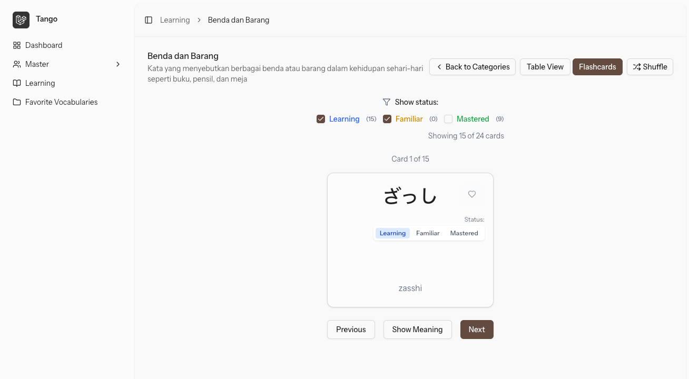

# Laravel Tango

Laravel Tango is a Laravel 12 application for managing Japanese vocabulary learning with hiragana support and user tracking.


## Features

- User authentication and management
- Categories for vocabulary organization
- **Japanese vocabulary** with **hiragana** support
- User vocabulary tracking and progress monitoring

## Requirements

- PHP 8.2 or higher
- Composer
- MySQL or compatible database
- Node.js and NPM (for frontend assets)

## Installation

1. Clone the repository:

```bash
git clone https://github.com/katzura1/laravel-tango.git
cd laravel-tango
```

2. Install dependencies:

```bash
composer install
npm install
npm run build
```

3. Setup environment:

```bash
cp .env.example .env
php artisan key:generate
```

4. Configure your database in the `.env` file:

```
DB_CONNECTION=mysql
DB_HOST=127.0.0.1
DB_PORT=3306
DB_DATABASE=laravel_tango
DB_USERNAME=root
DB_PASSWORD=
```

5. Run migrations:

```bash
php artisan migrate
```

6. Start the server:

```bash
php artisan serve
```

## Project Structure

- **Users**: Authentication, roles, and profiles
- **Categories**: Organize Japanese vocabulary by topics or levels
- **Vocabulary**: Manage Japanese words with hiragana, definitions, and examples
- **User Vocabulary**: Track user learning progress with Japanese vocabulary

## License

This project is open-sourced software licensed under the [MIT license](https://opensource.org/licenses/MIT).
